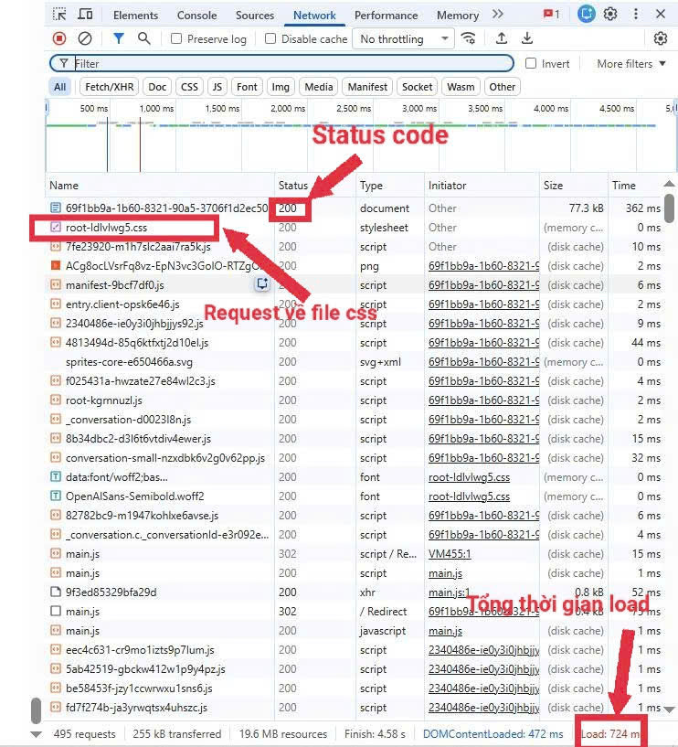
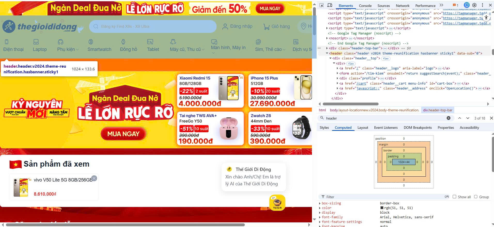
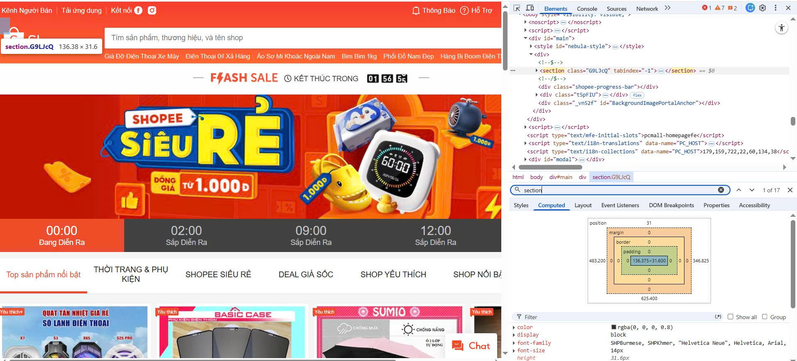
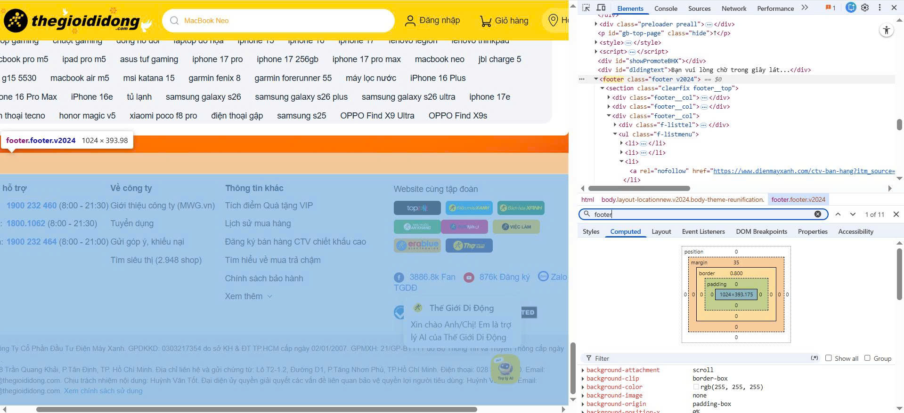
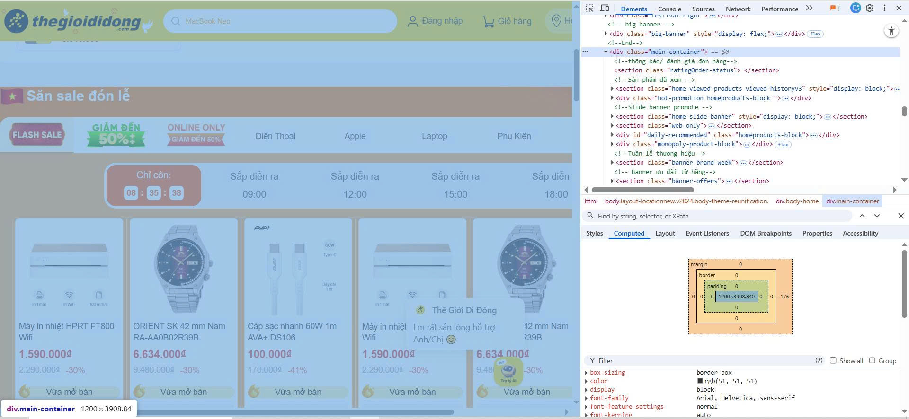
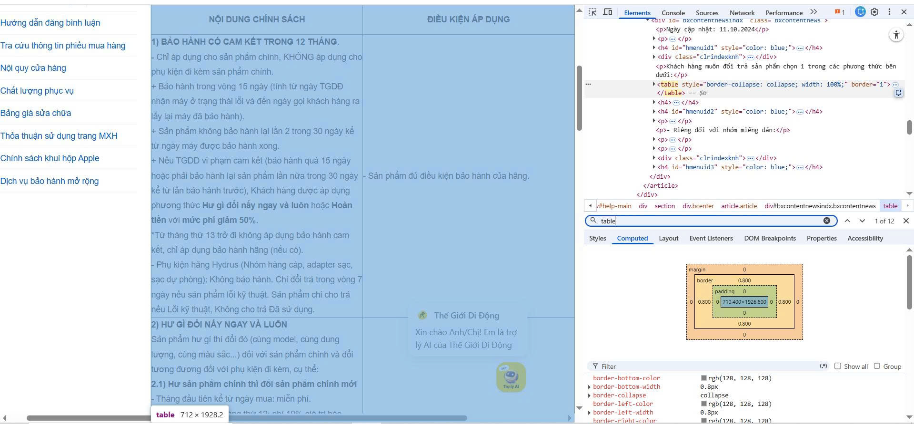
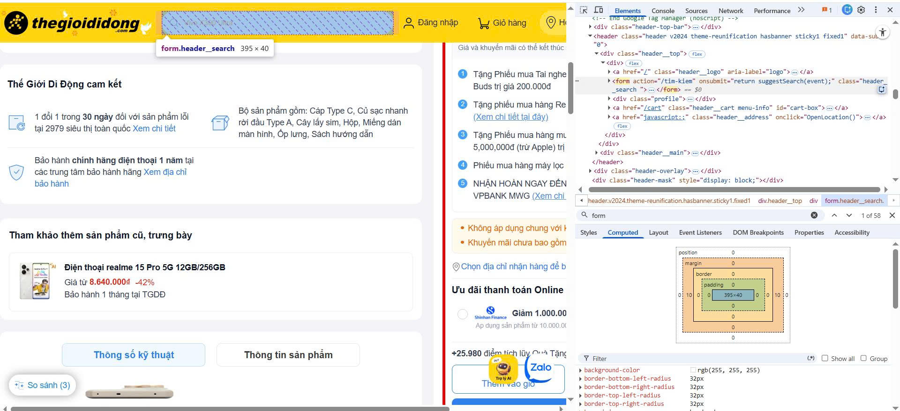

# Phần A: Đọc Hiểu

_Câu A1_

Khi gõ https://shopee.vn vào trình duyệt và nhấn Enter, thứ tự 5 bước xảy ra là:

1. Gửi Request: trình duyệt trước tiên sẽ hỏi DNS Server để xác định “shopee.vn” tương ứng với địa chỉ IP nào. Sau khi nhận được IP, nó gửi yêu cầu (request) đến server thông qua Internet.
2. Server xử lý: server nhận request và hiểu rằng người dùng muốn truy cập vào trang chủ Shopee, sau đó bắt đầu xử lý.
3. HTTP Response: server phản hồi bằng cách gửi lại các tài nguyên cần thiết như HTML, CSS, JavaScript cho trình duyệt.
4. Parse html, css & execute js: trình duyệt đọc file HTML để xây dựng cấu trúc trang, áp dụng CSS để định dạng giao diện và thực thi JavaScript để xử lý logic.
5. Paint & render: trình duyệt tổng hợp tất cả và hiển thị trang web hoàn chỉnh lên màn hình cho người dùng.

Tab Network cho thấy toàn bộ các request mà trình duyệt gửi đi khi tải trang



_Câu A2_

Lỗi 1 — Dùng `<div>` thay vì thẻ semantic
Trang web đang dùng `<div>` cho các khu vực như header, menu, nội dung và footer. Điều này khiến Google không xác định được cấu trúc trang. Các class như "header" chỉ có ý nghĩa với người đọc code, còn công cụ tìm kiếm thì không hiểu được vai trò của chúng.u.

Lỗi 2 — Không có thẻ `<h1>` hay heading nào
Tên sản phẩm “iPhone 16 Pro” nằm trong `<div>` nên không được nhận diện là tiêu đề chính của trang.

Lỗi 3 — Thẻ `` thiếu thuộc tính alt
Google dựa vào alt để hiểu nội dung hình ảnh. Thiếu alt thì ảnh không có ý nghĩa với SEO và cả screen reader.

Lỗi 4 — Menu điều hướng không dùng `<nav>`
Menu được đặt trong `<div class="menu">` thay vì `<nav>`. Điều này khiến Google không nhận diện được đây là khu vực điều hướng, từ đó ảnh hưởng đến việc phân tích cấu trúc trang.

## Sửa lại lỗi

```html
<header>
  <div class="logo">ShopTLU</div>
  <nav>
    <ul>
      <li><a href="/">Trang chủ</a></li>
      <li><a href="/products">Sản phẩm</a></li>
    </ul>
  </nav>
</header>

<main>
  <article class="product">
    <h1>iPhone 16 Pro</h1>
    <p class="price">25.990.000đ</p>
    
  </article>
</main>

<footer>© 2026 ShopTLU</footer>
```

_Câu A3_

```
┌─────────────┐
│   Hộp 1     │  ← div: chiếm cả hàng
└─────────────┘
Text A Text B     ← span: nằm cùng hàng nhau
┌─────────────┐
│   Hộp 2     │  ← div: xuống hàng mới
└─────────────┘
Text C **Text D**  ← span + strong: cùng hàng, Text D in đậm
┌─────────────┐
│   Hộp 3     │  ← div: xuống hàng mới
└─────────────┘
```

_Câu A4_

`<thead>` phần đầu bảng, chứa tiêu đề các cột
`<tbody>` phần thân bảng, chứa dữ liệu chính
`<tfoot>` phần cuối bảng, thường dùng cho tổng kết

Lý do không nên dùng table để tạo layout trang web

1. Lý do 1 — Sai ngữ nghĩa (semantic)
  `<table>` dùng để hiển thị dữ liệu dạng bảng, không phải để chia layout. Khi dùng sai, Google và screen reader sẽ hiểu đây là bảng dữ liệu , làm SEO và accessibility kém đi.

2. Lý do 2 — Code phức tạp, khó bảo trì
  Layout bằng table phải lồng nhiều `<tr>`, `<td>` nên code dễ rối. Khi cần thay đổi bố cục hoặc thêm phần tử, phải sửa nhiều chỗ.

3. Lý do 3 — Tải chậm hơn
   Trình duyệt thường phải xử lý gần như toàn bộ bảng trước khi hiển thị, vì cần tính kích thước các ô.

# Phần B: Thực hành code

_Câu B3_

Lỗi 1: Dòng 1 — Thiếu khai báo chuẩn HTML `<!DOCTYPE>` sai , sửa thành `<!DOCTYPE html>`

Lỗi 2: Dòng 2 — Thẻ `<html>` thiếu thuộc tính lang, sửa thành `<html lang="vi">`

Lỗi 3: Dòng 4 — Thẻ `<title>` không đóng, sửa thành `<title>Trang web</title>`

Lỗi 4: Dòng 5 — `<meta charset="utf8">` sai giá trị charset — Sửa thành `<meta charset="UTF-8">`

Lỗi 5: Dòng 8 — `<h1>Welcome to ShopTLU<h1>` thẻ đóng thiếu dấu `/` — Sửa thành `<h1>Welcome to ShopTLU</h1>`

Lỗi 6: Dòng 11 — `<a href="home">Trang chủ<a>` thẻ đóng thiếu dấu `/` và href không dùng `#` — Sửa thành `<a href="#home">Trang chủ</a>`

Lỗi 7: Dòng 19 — `` src không có dấu nháy và thiếu thuộc tính `alt` — Sửa thành ``

Lỗi 8: Dòng 21 — `<p>Giá: <b>25.990.000đ</p></b>` thẻ đóng bị lồng sai thứ tự — Sửa thành `<p>Giá: <b>25.990.000đ</b></p>`

Lỗi 9: Dòng 26 — Hàng đầu tiên của bảng dùng `<td>` thay vì `<th>`, và bảng thiếu `<thead>`/`<tbody>` — Sửa bằng cách thêm `<thead><tbody>` và đổi `<td>` thành `<th>` cho hàng tiêu đề

Lỗi 10: Dòng 40 — Dùng `<main>` lần 2 cho sidebar — Một trang chỉ được có 1 thẻ `<main>`, sidebar phải dùng `<aside>` — Sửa thành `<aside>` nằm trong `<main>`

Lỗi 11: Dòng 17 — `<h1>` nằm ngoài `<header>` và đứng trước `<header>` — Semantic sai, `<h1>` nên nằm trong `<header>`


_Câu B4_g

Trong trang web thegioididong.com:

1. 3 thẻ semantic HTML5 mà trang đó sử dụng

- Thẻ `<header>`:
  

- Thẻ `<section>`
  

- Thẻ `<footer>`
  

- Thẻ `<body>`mà trang đó KHÔNG dùng đúng semantic
  

2. Thẻ `<table>` hiển thị chi tiết nội dung sản phẩm.
   

3. Thẻ `<form>`
   

Form có action là <`action="/tim-kiem"`>. Khi submit, dữ liệu sẽ được gửi đến đường dẫn `/tim-kiem`

Không có method nên sẽ mặc định là GET

Input có 2 loại là text để nhập và button để click

# Phần C: Suy luận

_Câu C1_

```html
<!doctype html>
<html lang="vi">
  <head>
    <meta charset="UTF-8" />
    <meta name="viewport" content="width=device-width, initial-scale=1.0" />
    <title>iPhone 16 Pro — ShopTLU</title>
  </head>
  <body>
    <header>
      <!-- header: phần đầu trang, chứa logo và nav -->
      <div class="logo">ShopTLU</div>
      <!-- div: nhóm logo -->
      <nav>
        <!-- nav: điều hướng chính của trang -->
        <ul>
          <!-- ul: danh sách menu không có thứ tự -->
          <li><a href="#home">Trang chủ</a></li>
          <li><a href="#products">Sản phẩm</a></li>
          <li><a href="#contact">Liên hệ</a></li>
        </ul>
      </nav>
    </header>

    <nav aria-label="breadcrumb">
      <!-- nav: điều hướng phụ, aria-label phân biệt với nav chính -->
      <ol>
        <!-- ol: có thứ tự rõ ràng (Trang chủ > Điện thoại > Sản phẩm) -->
        <li><a href="#">Trang chủ</a></li>
        <li><a href="#">Điện thoại</a></li>
        <li aria-current="page">iPhone 16 Pro</li>
        <!-- aria-current: báo đây là trang hiện tại -->
      </ol>
    </nav>

    <main>
      <!-- main: nội dung chính, mỗi trang chỉ có 1 thẻ main -->

      <section id="product-detail">
        <!-- section: khu vực thông tin sản phẩm có chủ đề rõ ràng -->

        <figure>
          <!-- figure: nhóm ảnh có liên quan đến nhau -->
          
          <!-- loading = lazy là khi người dùng lướt đến mới load ảnh -->
          
          
          
          
          <figcaption>iPhone 16 Pro — 5 góc nhìn</figcaption>
          <!-- figcaption: mô tả cho figure -->
        </figure>

        <article>
          <!-- article: thông tin sản phẩm là nội dung độc lập, có thể đứng riêng -->
          <h1>iPhone 16 Pro</h1>
          <!-- h1: tiêu đề quan trọng nhất trang -->
          <p><strong>25.990.000đ</strong></p>
          <!-- strong: nhấn mạnh giá, có ngữ nghĩa "quan trọng" -->
          <div class="rating">
            <!-- div: nhóm đánh giá sao, không có thẻ semantic phù hợp hơn -->
            <span>★★★★★</span>
            <!-- span: inline text, không cần block element -->
            <span>(1.234 đánh giá)</span>
          </div>
          <p>
            Chip A18 Pro, Camera 48MP, màn hình 6.3 inch Super Retina XDR, pin
            cả ngày.
          </p>
        </article>
      </section>

      <section id="specs">
        <!-- section: khu vực thông số kỹ thuật riêng biệt -->
        <h2>Thông số kỹ thuật</h2>
        <table border="1">
          <!-- table: đúng mục đích hiển thị dữ liệu dạng bảng -->
          <thead>
            <!-- thead: phân biệt phần tiêu đề với dữ liệu -->
            <tr>
              <th>Thông số</th>
              <!-- th: tiêu đề cột, Google hiểu đây là nhãn -->
              <th>Chi tiết</th>
            </tr>
          </thead>
          <tbody>
            <!-- tbody: chứa dữ liệu chính của bảng -->
            <tr>
              <td>Chip</td>
              <td>Apple A18 Pro</td>
            </tr>
            <tr>
              <td>RAM</td>
              <td>8GB</td>
            </tr>
            <tr>
              <td>Bộ nhớ</td>
              <td>256GB</td>
            </tr>
            <tr>
              <td>Camera</td>
              <td>48MP + 12MP + 12MP</td>
            </tr>
            <tr>
              <td>Pin</td>
              <td>3274mAh</td>
            </tr>
          </tbody>
        </table>
      </section>

      <section id="reviews">
        <!-- section: khu vực đánh giá riêng biệt -->
        <h2>Đánh giá từ khách hàng</h2>

        <article>
          <!-- article: mỗi bình luận là nội dung độc lập -->
          <h3>Nguyễn Văn A</h3>
          <p>Sản phẩm rất tốt, giao hàng nhanh!</p>
        </article>

        <article>
          <h3>Trần Thị B</h3>
          <p>Camera chụp đẹp, pin trâu, rất hài lòng.</p>
        </article>
      </section>

      <aside>
        <!-- aside: sản phẩm tương tự là nội dung phụ, bỏ đi không ảnh hưởng nội dung chính -->
        <h2>Sản phẩm tương tự</h2>
        <ul>
          <!-- ul: danh sách sản phẩm không có thứ tự -->
          <li>
            <a href="#">
              
              <p>iPhone 15 Pro</p>
              <p><strong>22.990.000đ</strong></p>
            </a>
          </li>
          <li>
            <a href="#">
              
              <p>Samsung Galaxy S25</p>
              <p><strong>22.490.000đ</strong></p>
            </a>
          </li>
        </ul>
      </aside>
    </main>

    <footer>
      <!-- footer: chân trang -->
      <p>&copy; 2026 ShopTLU. All rights reserved.</p>
      <nav>
        <!-- nav: điều hướng footer -->
        <a href="#">Chính sách bảo mật</a>
        <a href="#">Liên hệ</a>
        <a href="#">FAQ</a>
      </nav>
    </footer>
  </body>
</html>
```

_Câu C2_

Quan điểm "dùng `<div>` cho mọi thứ rồi thêm class là được" nghe có vẻ tiện, nhưng thực ra đang bỏ qua những lợi ích kỹ thuật quan trọng. Về mặt **SEO**, Google không chỉ đọc nội dung mà còn đọc cấu trúc trang — khi dùng `<article>`, `<nav>`, `<header>`, Google biết ngay đâu là nội dung chính, đâu là điều hướng, từ đó xếp hạng trang cao hơn so với đối thủ chỉ dùng `<div>`. Về mặt **Accessibility**, người khiếm thị dùng screen reader để duyệt web — phần mềm này dựa vào semantic tags để nhảy thẳng đến `<main>` hay `<nav>` mà không cần đọc toàn bộ trang. Nếu tất cả là `<div>`, screen reader không biết đường mà nhảy. Ví dụ cụ thể: thay `<div class="nav">` bằng `<nav>`, người dùng bàn phím có thể nhấn phím tắt để nhảy thẳng đến menu — điều này hoàn toàn không làm được với `<div>`. Tuy nhiên, `<div>` vẫn hoàn toàn phù hợp khi cần nhóm phần tử để áp dụng CSS mà không có thẻ semantic nào phù hợp hơn, ví dụ `<div class="card-grid">` để tạo layout grid. Tóm lại, học thêm khoảng 10 thẻ semantic không tốn nhiều thời gian, nhưng lợi ích mang lại cho SEO, accessibility và khả năng đọc code là rất đáng giá.